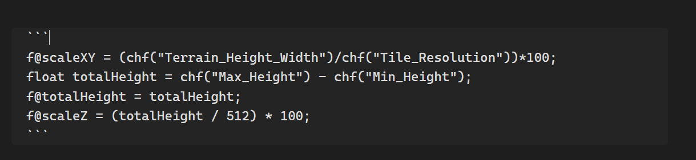
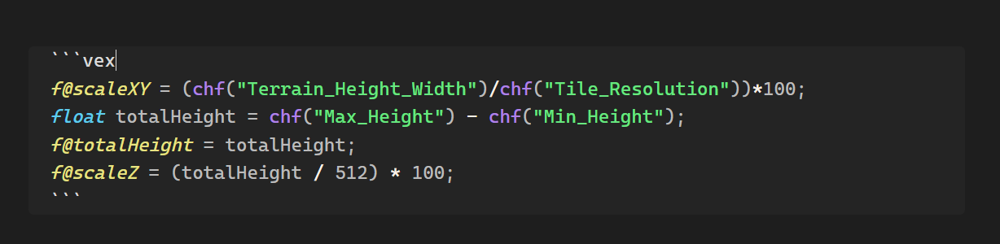

a grammar and theme file for Houdini's Vector Expressions (vex) language for use with Obsidian.

Usage

Install and enable Shiki Highlighter Community Plugin for Obsidian

https://github.com/mProjectsCode/obsidian-shiki-plugin

Create two folders anywhere within your vault, for example

```
/YourVault/ShikiGrammar/
/YourVault/ShikiThemes/
```

paste the grammar file `(/syntaxes/vex.tmLanguage.json)` and theme file `(/themes/vex.tmTheme.json)` into their respective folders, open the Shiki plugin settings and point the plugin towards these folders

when creating a new codeblock or inline code, use "vex" as the language identifier for the code block (the name after using three backticks to open a code block should be "vex")



