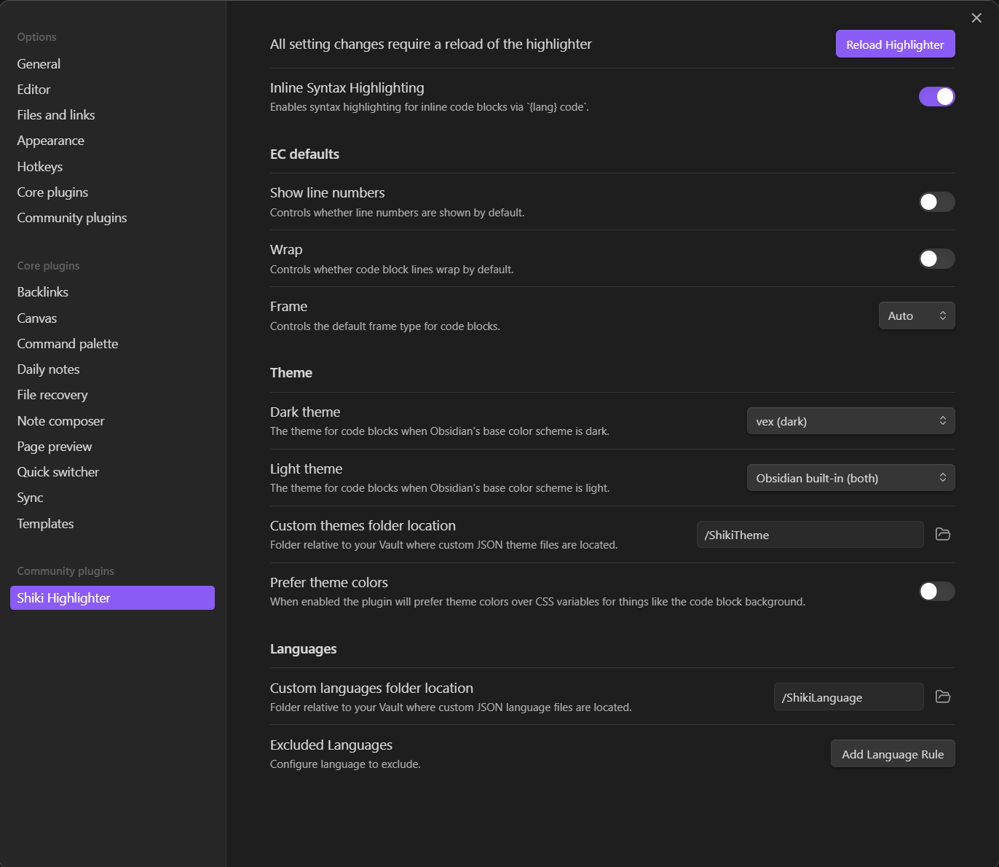

Syntax Highlighting for Houdini's [Vector Expressions](https://www.sidefx.com/docs/houdini/vex/index.html) language for [Obsidian](https://obsidian.md).

_VEX is a high-performance expression language used in many places in Houdini, such as writing shaders._


# Installation

1) Install and enable the [Shiki Highlighter Community Plugin](https://github.com/mProjectsCode/obsidian-shiki-plugin) for Obsidian

2) Create two folders within your Obsidian vault, for example

```
/YourVault/ShikiLanguage/
/YourVault/ShikiTheme/
```

3) Copy the grammar file `/syntaxes/vex.tmLanguage.json` and theme file `/themes/vex.tmTheme.json` into their respective folders

4) Open the Shiki plugin settings and point the plugin towards these folders

5) Select `vex` as the default theme in the plugin settings dropdown list

You might have to restart Obsidian for changes to take effect

______________


