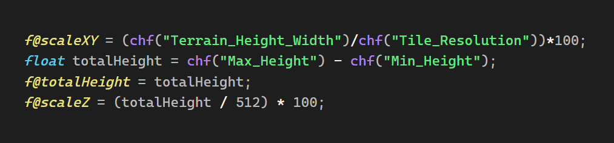

a grammar and theme file for Houdini's Vector Expressions (vex) language for use with Obsidian.

Usage

Install Shiki Highlighter Community Plugin for Obsidian

Create two folders anywhere within your vault

/YourVault/ShikiGrammar/

/YourVault/ShikiThemes/

paste the grammar and theme file into their respective folders, open the Shiki plugin settings and point the plugin towards them by filling in the folder paths

when creating a new codeblock or inline code, use "vex" as the language identifier for the code block (the name after using three backticks to open a code block should be "vex")

